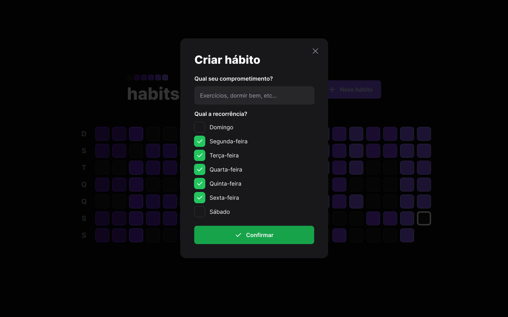
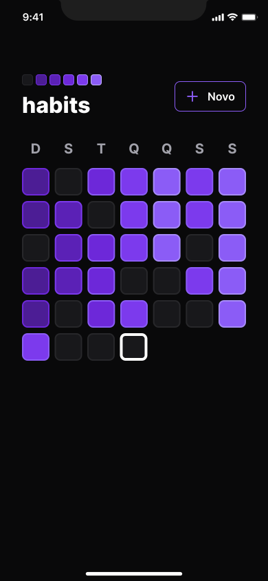
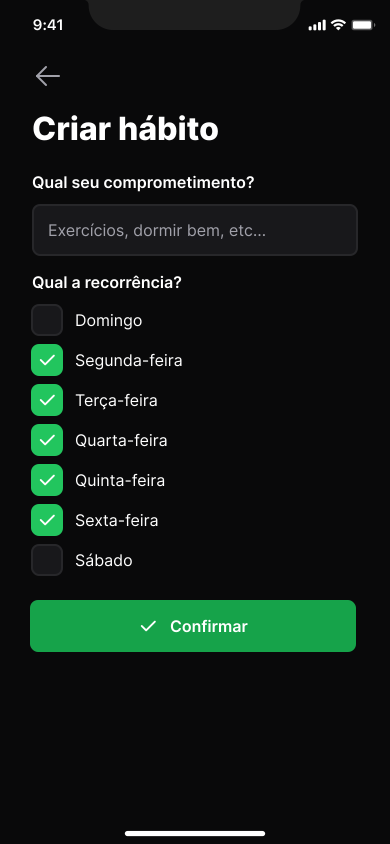

# Habitos NLW Setup • Trilha Ignite
<div align="center">

</div>

# Sobre

Projeto criado para ajudar a mapear seus hábitos e anotações diárias de tarefas diárias concluídas ou inacabadas.<br>
<!-- Hábits tem um gráfico diário que mostra com que frequência um hábito foi formado, permitindo que você veja como você mudou ao longo do tempo e fique motivado para continuar. -->

## Aulas
  * Iniciando o projeto <br>
    Iniciando o projeto foi apresentado as configurações do servidor com a biblioteca fastify, logo após foi a criação com o projeto React com Vite e o uso do framework do CSS Tailwind e por último, a criação do projeto em Mobile com Expo e Reactnative.<br><br>

  * Avançando o back-end e front-end<br>

    Na criação de Backend foi ensinado também a validação de dados com Zod e integração do banco de dados com Prisma.<br>
    No Frontend foi criado componentes e ensinando técnicas para lidar com datas.<br>
    Já no Mobile foi aprensentado a utilização do Nativewind para estilização com o Tailwind na web e também foram utilizados componentes novos e reaproveitados das funções da Web para utilização de datas.<br><br>

  * Finalizando o layout web e mobile<br>

    Concluimos as rotas do Backend e foi ensinado a utilizar o SQL no momento certo da aplição de como compor ele.<br>
    No Frontend foi hora de aprender o uso da biblioteca Radix-UI que ira criar os componentes de acessibilidade pré configurada e técnicas para utilização com classes condicionais usando o capote clsx.<br>
    No Mobile aprendendo a criação de novas telas e a Navegação usando o React Navigator e também foi ensinado a utilizar propriedades por contexto entre as rotas.<br><br>

  * Conectando a API <br>

    Nessa parte do projeto foi focado os dois projetos de frontend web e mobile. Aprendemos a buscar dados da API construída utilizando useEffect e axios, além de encaminhar os dados do formulãrio para a API e integrar todos os dados recebidos para concluir a interface da apliação web.<br>
    Na aplicação Mobile, um processo muito semelhante é realizado, onde os dados do backend são conecatados á interface e as inforamações do formulário de formação de hábitos são transferidos para API.<br><br>

  * O próximo nível<br>
    Foi feita toda a integração dos dados com a lista de hábitos exibida no gráfico diário na web e mobile. Também fizemos algumas alterações no estilo e nas animações para renderizar as ações sem problemas. <br><br>

  <div align="center">
  <h2>A aplicação foi criada ponta a ponta com serve, web e mobile esse é meu primeiro projeto criado ponta a ponta com server, web e mobile tive algumas dificuldades com banco de dados e aplicação mobile, pois nunca criei uma aplicação dessa, mais o aprendizado que tive nesse projeto foi muito gratificante.
  </h2></div>

---
<div align="center">
<h2>  Aplicação Mobile </h2>


</div>

---
<br><br>
## Instalação

```bash
git clone https://https://github.com/allesoares95/nlw-setup

cd nlw-setup

npm install

# rodar server;
npm run dev

# rodar web;
npm run dev

# rodar mobile;
npx expo start  
```

<br>

<h2 align="center"><strong>Utilização no projeto</strong></h2>
<h3 align="center">
<br>
  <strong>Mobile</strong><br>
  Expo<br>
  Axios<br>
  clsx<br>
  dayjs<br>
  Typescript<br>
  React Native<br>
  Nativewind<br>
  React Navigation<br>
  React Native SVG Transformer<br>
  React Native Reanimated<br><br><br>
  <strong>Web</strong><br>
  Typescript<br>
  React<br>
  Vite<br>
  Radix UI<br>
  Axios<br>
  clsx<br>
  dayjs<br>
  Tailwind <br><br><br>
  <strong>Server</strong><br>
  Typescript<br>
  Fastify <br>
  Prisma<br>
  dayjs<br>
  Zod<br>
  SQLite<br>
  </h2>
  